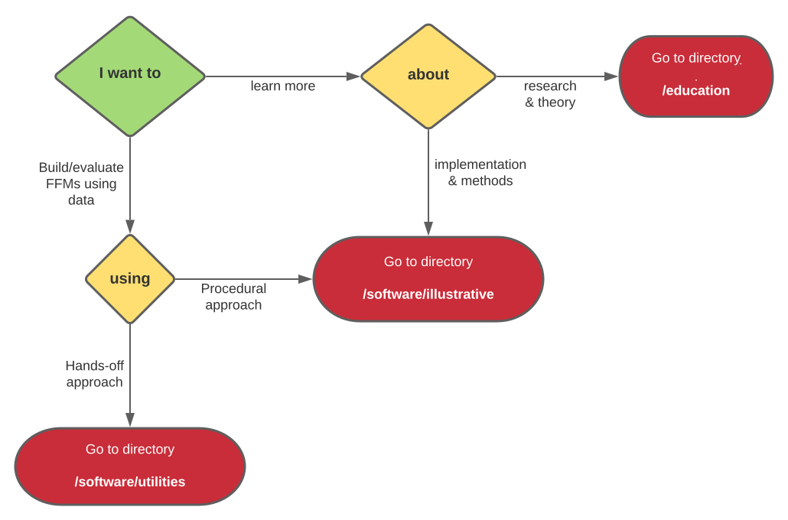

# The Fitness-Fatigue Model Project

## Introduction

This project is developing open-source, robust, and flexible [utilities](software/utilities) for fitting and evaluating fitness-fatigue models (FFMs); with modern optimisers, out-of-sample assessment, and input checking. In addition, [illustrative code](software/illustrative) (i.e. didactic-style) has been constructed, and which guides the user through the application of several advanced methods via an interactive procedural flow. Thorough documentation, explanatory examples, and mock data are provided with each software resource.

The goal of this project is to expedite research and development of fitness-fatigue models and methods in the sport and exercise sciences, and to reduce initial barriers to study. It is hoped the resources contained will be useful to researchers, educators, students and practitioners alike. The repository is not an endorsement of these models as "ready to use". Rather, it should be thought of as a set of tools to aid scientific understanding, accelerate development, and enrich discussion in this area of performance modeling in sport. Within the repository there are also rich educational materials for lecturers, students and practitioners seeking to learn more about this area of sport science.

## Navigating this repository

## Contribute

Get in touch if you have a resource you think would fit here. To do this open an issue or submit a pull request.

### Colleagues
- Ben Ogorek ([twitter](https://twitter.com/benogorek?lang=en), [github](https://github.com/baogorek), [website](https://www.ogorekdatasciences.com/), [medium](https://medium.com/@baogorek))
- Ben Stephens Hemingway ([github](github.com/bsh2))
- Paul Swinton ([github](github.com/p-swinton), [profile](https://www3.rgu.ac.uk/dmstaff/swinton-paul))

### Support

Issue Tracker: https://github.com/bsh2/Fitness-Fatigue-Models/issues

If you are having issues, please do let us know.
