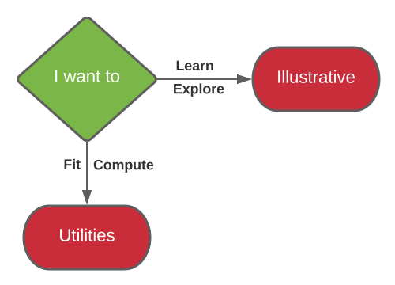

# Software

| Directory | Description | Language |
|-|-|-|
| illustrative | Illustrative code in a didactic-style that guides the user through the application of several advanced methods via an interactive procedural flow |  |
| utilities | Robust, and flexible code utilities for fitting and evaluating fitness-fatigue models (FFMs); with modern  optimisers, out-of-sample assessment, and input checking. |   |