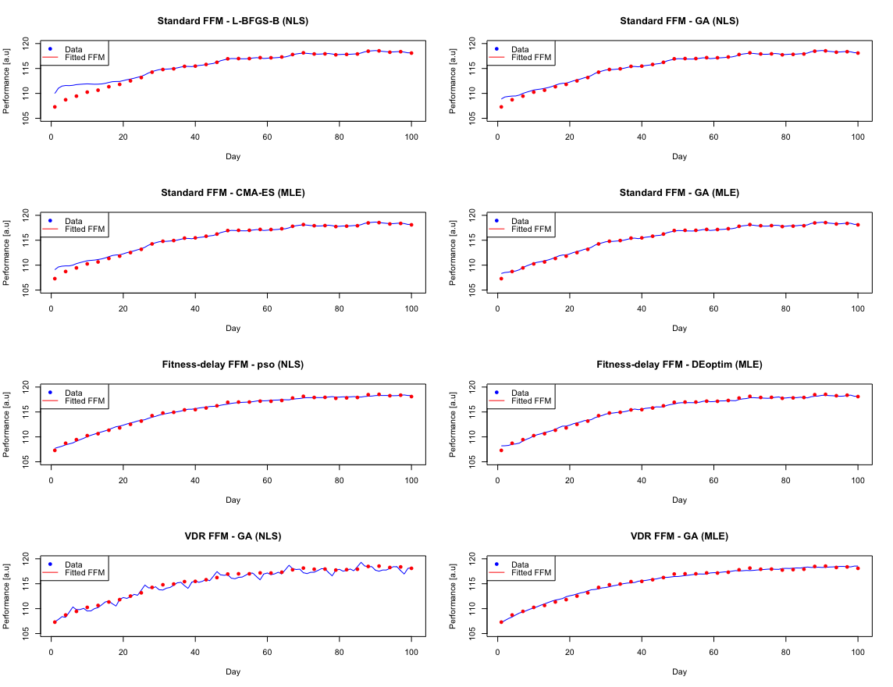
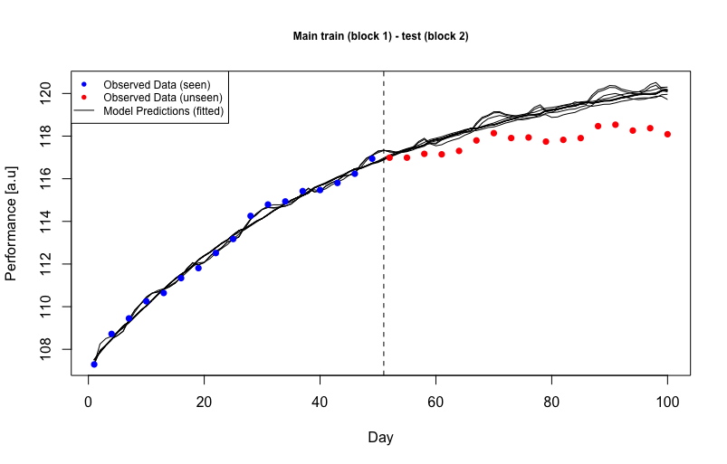
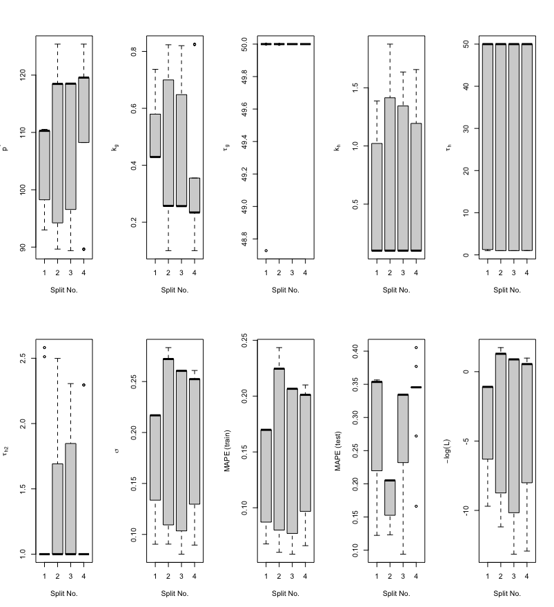

# Utilities: An R toolbox for fitting and evaluating FFMs

This directory includes easy to use [R](https://www.r-project.org/) functions for fitting and evaluating FFMs with modern optimisation options, and cross-validation (assessment of model performance).  
  
**Under development:** The files in this directory are undergoing a major redevelopment, and as such the associated documentation is still on it's way. In the meantime, the code files themselves are mostly self-contained from an explanatory point of view. The hope is to put these ** into a package ** as soon as I have time.

**Getting started:** To get started it is recommended the user visit the [example file](example.R), which has been produced to demonstrate the application of the files/functions contained in this repository. From there, they should then be able to get a feel for the particular bit of code they are interested in. Hopefully shortly documentation will be finished that makes this a bit easier.

***

**Files contained:**

| File | Contains | Model | Function name | Dependencies |
|-|-|-|-|-|
| [standard_ffm_objective.R](standard_ffm_objective.R) | Residual sum of squares and log-likelihood objective functions | Standard FFM | `standardObjectiveSS` `standardObjectiveLL` | - |
| [fitness_delay_ffm_objective.R](fitness_delay_ffm_objective.R) | Residual sum of squares and log-likelihood objective functions | Fitness-delay FFM | `fitnessDelayObjectiveSS` `fitnessDelayObjectiveLL` | - |
| [vdr_ffm_objective.R](vdr_ffm_objective.R) | Residual sum of squares and log-likelihood objective functions | VDR FFM | `vdrObjectiveSS` `vdrObjectiveLL` | - |
| [cross_validation.R](cross_validation.R) | Expanding-window CV function for the VDR model (fitting via parallelised L-BFGS-B multi-start) | VDR FFM | `vdrCrossValidate` | **Packages**:   `optimx` `caret` `RcppAlgos` `parallel``doSNOW` `foreach` **Files**: [vdr_ffm_objective.R](vdr_ffm_objective.R) [ffm_simulation.R](ffm_simulation.R) |
| [ffm_simulation.R](ffm_simulation.R) | Functions for simulating (computing/predicting) FFMs | Standard, Fitness-delay, VDR FFM | `standardPredict` `fitnessDelayPredict` `vdrPredict` | - |
| [example.R](example.R) | Demonstration of the use of the above files/functions under synthetic inputs and different optimisation algos | All | N/A | **Packages:**   `optimx` `GA`  `pso` `cmaes`  `DEoptim` `caret` `RcppAlgos` `parallel` `doSNOW` `foreach`  **Files:**All in folder |

***

**Model Fitting:** Example plots showing fitted models from [example.R](example.R) via Maximum Likelihood Estimation (MLE) or Nonlinear Least-Squares (NLS) for multiple algorithmic approaches (quasi-Newton, Genetic Algorithm, Differential Evolution, Particle Swarm, CMA-ES)

***

**Cross Validation:** Example plots showing the VDR model fitted to the synthetic data from [example.R](example.R) via MLE for a quasi-Newton algorithm under multi-start within a cross-validation framework

