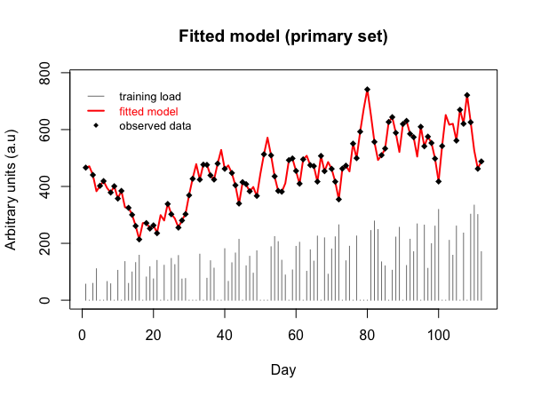

# Utilities: An R toolbox for fitting and evaluating FFMs

This directory includes easy to use [R](https://www.r-project.org/) functions for fitting and evaluating FFMs with modern optimisers, cross-validation, and input checking. Complete [documentation](documentation/utilities_documentation.pdf) is provided for each. Furthermore, code files with reproducible examples are provided [here](documentation/code_examples).

*An introductory example for one function is provided further down in this README.*

## Currently available functions:

| Function | Code file | Description | Usage | Optimiser | Features |
|-|-|-|-|-|-|
| `banisterModel()` | [banisterModel.R](banisterModel.R) | Numerically solve system of ODE's and fit the standard model from first principles | [docs]() [example]() | GA or L-BFGS-B | Bounds, estimation of initial conditions, cross validation, genetic algorithms |
| `standardModel()` | [standardModel.R](standardModel.R) | Fitting function for the explicit solution to the standard two component model | [docs]() [example]() | GA or L-BFGS-B | Bounds, include estimation of initial components, cross validation, genetic algorithms |
| `calvertModel()` | [calvertModel.R](calvertModel.R) | Fitting function for the explicit solution to the fitness-delay model | [docs]() [example]() | GA or L-BFGS-B | Bounds, include estimation of initial components, cross validation, genetic algorithms |
| `turnerModel()` | [turnerModel.R](turnerModel.R) | Numerically solve system of ODE's and fit the non-linear variant of the standard model | [docs]() [example]() | GA | Bounds, estimation of initial conditions, cross validation |
| `computeModels()` | [computeModels.R](computeModels.R) | Compute model predictions for a definite set of model parameters and load series | [docs]() [example]() | NA - Simple computation | Compute with or without initial traces for discrete models |

### Experimental features:

These are functions that are currently under experimental development. They will become full features of the project, or removed if not proven to work well. Use with caution

| Function | File | Description | 
|-|-|-|
| `basicModel()` | [basicModel.R](basicModel.R) | Fit the one-component model

### Import a function directly into R from github

#### Step 1: Install and load the R package `devtools`

    install.packages("devtools")
    library(devtools)

#### Step 2: Import the required function

| Function | Code (copy, paste, run) |
|-|-|
| `banisterModel()` | `source_url( https://raw.githubusercontent.com/bsh2/Fitness-Fatigue-Models/main/software/utilities/banisterModel.R )` |
| `standardModel()` | `source_url(https://raw.githubusercontent.com/bsh2/Fitness-Fatigue-Models/main/software/utilities/standardModel.R)` |
| `calvertModel()` | `source_url( https://raw.githubusercontent.com/bsh2/Fitness-Fatigue-Models/main/software/utilities/calvertModel.R )` |
| `turnerModel()` | `source_url( https://raw.githubusercontent.com/bsh2/Fitness-Fatigue-Models/main/software/utilities/turnerModel.R )` |
| `computeModels()` | `source_url( https://raw.githubusercontent.com/bsh2/Fitness-Fatigue-Models/main/software/utilities/computeModels.R )` |
    
## An introductory example (getting started)

Consider a researcher looking to fit an FFM to a set of experimental data (i.e. time-series of quantified training load and measured performance values)

*Note, you will need to have installed the following packages* (`RCurl`,`devtools`) *to follow along with this example your own R interpreter/environment (e.g. [R-studio Recommended](https://rstudio.com/)). You can do this by running the following code:*

    install.packages("RCurl")
    install.packages("devtools")

### 1. Load (input) data

To begin with, the researcher imports or loads thier data into the R environment. For the purposes of the example, we import a set of mock data provided [here](documentation/data/mockData.csv) using the code below:

    library(RCurl)
    mockData = getURL("https://raw.githubusercontent.com/bsh2/Fitness-Fatigue-Models/main/software/utilities/documentation/data/mockUpper.csv")
    mockData = read.csv(textConnection(mockData))

We briefly insect the structure of the dataset. It should be in three column form, in the order "days", "performances", "loads". NA values should be used in the performances column to indicate missing observed data, and load values of zero indicate that no training has taken place on a given day in the series. Run the following command:

    head(mockData)
    
Note the following console output. The order of the data, and appropriate use of NA or zero values as described is important. This format is consistent for all functions in the repository for input data:

    days   performances    loads
       1          466.2    56.35
       2             NA     0.00
       3          440.5    59.15
       4             NA   110.60
       5          402.3     0.00
       6          418.9     0.00
    
*Note: The order of the data, and appropriate use of NA and zero values as described is important, and this format is consistent across all the functions.*

### 2. Import the model fitting function

You can read more about the available functions and associated code files in the [documentation](documentation/utilities.pdf). However, for this example we will consider the standard fitness-fatigue model, described as follows:

As a user, you can choose to [download](standardModel.R) and source the code file into your environment yourself. But arguably the more convenient method is to use the package `devtools` to source the file directly into R. To do the latter we first find the 'raw' URL for the code file (see [this guide](https://help.data.world/hc/en-us/articles/115006300048-GitHub-how-to-find-the-sharable-download-URL-for-files-on-GitHub)). Once we have this, we just run the following code:

    library(devtools)
    source_url(https://raw.githubusercontent.com/bsh2/Fitness-Fatigue-Models/main/code/utilities/standardModel.R)
    
You will then notice the function `standardModel()` appears in your global environment. This is the function we will use shortly.

### 3. Set up constraints and fit the model

Most of the functions included in this repository provide some useful customisation (e.g. optimisation approach, out-of-sample assessment parameters, parallel optimisation, initial traces for fitness/fatigue), so its important that as a user you look through the [documentation]() to assess the right arguments for your use-case. However, a consistent requirement is the specification of box constraints for the model parameters. 

In the case of the standard model (without initial components), there are 5 free parameters (p*, kg, Tg, kh, Th), and so we specify constraints for these as follows:
      
    # Order of vector: p*, kg, Tg, kh, Th
    boxConstraints = data.frame("lower" = c(150, 0.8, 1, 0.8, 1),
                                "upper" = c(800, 3, 50, 3, 50))

When fitting the standard model via a gradient-descent approach (default), starting values for the optimizer must be provided. This is as simple as assigning the following vector:

    # Order of vector: p*, kg, Tg, kh, Th
    startAt = c(400, 1, 30, 1.3, 15)

Call the fitting function (gradient-descent optimisation as default) with out-of-sample assessment via an expanding-window approach

    fittedModel = standardModel(inputData = mockData,
                                constraints = boxConstraints,
                                startingValues = startAt,
                                doTrace = TRUE)

Various progress info is provided during the fitting process if argument `doTrace = TRUE`.

    [1] No initialWindow argument supplied
    [1] Defaults used for initialWindow, testHorizon and expandRate
    [1] -----------------------------------------------------------
    [1] initialWindow = 67 days | (60%)
    [1] testHorizon = 22 days | (20%)
    [1] expandRate = 4 days | (4%)
    [1] -----------------------------------------------------------
    [1] Check these are appropriate for your implementation
    iter   10 value 3282.025078
    iter   20 value 3075.110966
    iter   30 value 2992.355807
    iter   40 value 521.848620
    iter   50 value 130.772137
    iter   60 value 121.758553
    iter   70 value 114.062328
    iter   80 value 10.139348
    iter   90 value 0.472754
    final  value 0.472754 
    converged
    ...

Once the process has finished, output is provided in the console and plotting window to assist in quantifying model fit and average model performance (i.e. via out-of-sample assessment). This information is also saved to the object assigned to the function call.

    [1] Process completed: Printing main summary information
    [1] ------------------------------------------------------------------
    [1] Optimisation summary (Main Set):
    [1] 
           p0 k_g  Tau_g   k_h  Tau_h   MSE counts_fn counts_gn convcode
      499.645 0.8 20.386 1.402 10.125 0.473       107       107        0
      
                                          convergence
      CONVERGENCE: REL_REDUCTION_OF_F <= FACTR*EPSMCH

        Model fit metrics (Main set):
        
           RSQ       RMSE        MAPE
        99.996   0.687571   0.1421066

    [1] "Printing cross-validation information"
    [1] ------------------------------------------------------------------
    [1] Summary statistics across expanding windows:
    
            RSQtrain RMSEtrain  MAPEtrain RMSEtest  MAPEtest
    Min.     99.9950 0.4466963 0.09074603 1.419750 0.2408380
    1st Qu.  99.9960 0.4646787 0.09558683 1.610950 0.2629409
    Median   99.9970 0.5438228 0.10714373 1.643802 0.2636312
    Mean     99.9964 0.5260290 0.10824618 1.642467 0.2738462
    3rd Qu.  99.9970 0.5840220 0.12238690 1.726176 0.2995587
    Max.     99.9970 0.5909250 0.12536742 1.811659 0.3022620
    
    [1] Model metrics for each expanding window
    
            RSQtrain RMSEtrain  MAPEtrain RMSEtest  MAPEtest
    slice_1   99.997 0.4466963 0.09074603 1.726176 0.2995587
    slice_2   99.997 0.4646787 0.09558683 1.811659 0.3022620
    slice_3   99.995 0.5438228 0.10714373 1.610950 0.2636312
    slice_4   99.996 0.5840220 0.12238690 1.419750 0.2408380
    slice_5   99.997 0.5909250 0.12536742 1.643802 0.2629409
    
    [1] Fitted parameter values across expanding windows:
    
                  p0 k_g    Tau_g      k_h    Tau_h
    slice_1 500.0468 0.8 20.52273 1.402431 10.17462
    slice_2 500.1330 0.8 20.50480 1.402960 10.16465
    slice_3 500.1174 0.8 20.48568 1.402744 10.16055
    slice_4 499.8783 0.8 20.47246 1.401686 10.16378
    slice_5 499.8289 0.8 20.45724 1.401614 10.15852

    [1] ------------------------------------------------------------------
    [1] COMPLETE. Returning object